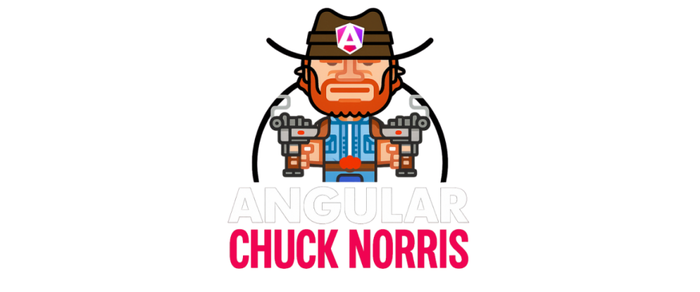
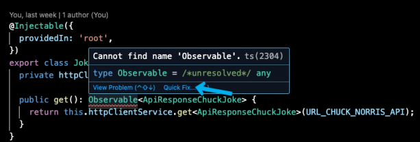

# Start 🚀

Die Angular Chuck Norris Challenge ist dein erster Einstieg in die Angular Webapp Entwicklung. Erledige alle Challenges, damit Chuck Norris .. und die innFactory stolz auf dich sind! Im Rahmen des Projekts wirst du das Frontend einer 404 Not-Found Seite gestalten, mehr über das Global State Management und die reaktive Programmierung in Angular erfahren, selbst eine Katzenbild-API anbinden und als Bonus Aufgabe deine Daten in einer selbst aufgesetzten, externen Datenbank speichern.

---

# Ⅰ. Challenge 🎖️ - Start

### Ⅰ.Ⅰ. GitHub Account

Jeder geschriebene Programmcode muss auch gespeichert und weitergegeben werden können. GitHub ist eine übergreifende Entwicklerplattform die das ermöglicht und auch dieses Projekt speichert.
Du wirst später nicht nur deinen Programmcode mit anderen Kollegen in Projekten teilen (=to publish), sondern in sogenannten Code-Reviews gegenseitig den Code überprüfen und verbessern. Code-Reviews wirst du beim Angular Chuck Norris Projekts noch nicht machen.

- Erstelle dir, falls du noch keinen hast, zunächst einen eigenen [Github Account][github-home] . Dieser wird dich bei der innFactory und im späteren Entwickler-Leben noch oft begleiten 🤩.

### Ⅰ.Ⅱ. Entwickeln aus der Entwicklungsumgebung

Softwareentwickler benötigen einen Ort an dem sie den Programmcode ansehen, schreiben und verändern können. Dieser Ort ist die sogenannte Entwicklungsumgebung, auf englisch "Integrated Development Environment", abgekürzt IDE. Für die Angular Chuck Norris App benutzen du als IDE am Besten VS Code.

- Installiere dir [Visual Studio Code][visual-studio-code].
- Öffne VS Code. Mache dich mit diesem [Tutorial][vscode-getting-started] in VS Code etwas vertraut.

### Ⅰ.Ⅲ. Webapp kopieren

In GitHub online gespeicherte Software muss zum Bearbeiten erst lokal auf deinem PC kopiert werden (=to clone). Das geht ebenfalls ganz einfach mit VS Code.
VS Code kommt standardmäßig mit einer Anbindung für GitHub, dem "Source Control Management".

- Öffne den Tab des Source Control und wähle "Clone Repository". Gebe nun die URL des Repositories `https://github.com/innFactory/angular-chuck-norris` ein und wähle einen beliebigen Speicherort auf deinem PC.


### Ⅰ.Ⅳ. Nodejs installieren

Die meisten Webapp Projekte haben Abhängigkeiten an andere Bibliotheken in Form von Paketen. Diese können mit dem Node Package Manager von Nodejs unkompliziert installiert werden. Installiere dir hierfür nun Nodejs und führe Node und NPM zum Test im Terminal in VS Code aus.

- Installiere die Nodejs über den Installer [Nodejs Download][nodejs-download].
- Prüfe ob die Befehle `node`und `npm` in deinem System global funktionieren.
- Öffne dazu in VS Code das Terminal über die obere Leiste `View -> Terminal`.
- Gebe im Terminal die folgenden Befehle ein. Nacheinander solltest du die aktuell installierte Version sehen.

  ```bash
    node --version
    # Ausgabe z.B. "v22.18.0".

    npm --version
    # Ausgabe z.B. "10.9.3".

    npx --version
    # Ausgabe z.B. "10.9.3".
  ```

- Mache dich über die weiteren Funktionen von NPM vertraut [https://docs.npmjs.com/about-npm][npmjs-docs].

### Ⅰ.Ⅴ. Abhängigkeiten installieren

Nun musst du dir die Abhängigkeiten bzw. Dependencies nur noch installieren. Keine Sorge, die sind in der Datei [package.json](package.json) bereits vollständig aufgelistet und können ohne weiteres über einen Konsolenbefehl installiert werden.

- Gebe in die Konsole `npm install` ein und und warte bis alle erfolgreich heruntergeladen sind.
- Ein neuer Ordner [node_modules/](node_modules/) mit allen externen Bibliotheken, wird nun im Projekt automatisch erstellt.

### Ⅰ.Ⅵ. Webapp starten

Nun kannst du das Webprojekt aus der Konsole starten mit `npm start`.

- Öffne den Browser auf [http://localhost:4200](http://localhost:4200) und du solltest die Webapp sehen.
- In der Konsole kannst du den laufenden, lokalen Client sehen.

  ```
  ~/code/intern/angular-chuck-norris
  npm start
  > angular-chuck-norris@1.0.0 start
  > ng serve
  Initial chunk files | Names Raw size
  main.js main 116.17 kB
  styles.css I styles 10.13 kB
  | Initial total | 126.30 kB
  Application bundle generation complete. [2.387 seconds]
  Watch mode enabled. Watching for file changes...
  NOTE: Raw file sizes do not reflect development server per-request transformations.
  10:03:05 AM [vitel (client) Re-optimizing dependencies because vite config has changed
  Local: http://localhost: 4200/
  press h + enter to show help
  ```

### Ⅰ.Ⅶ. Einstieg in die App

Jede Angular Komponente in deiner Webapp besteht aus einem Logik-, einem Struktur- und einem Stylingteil. Fühle dich nicht überfordert von all den verschiedenen Sprachen und Frameworks. Du bekommst eine Schritt für Schritt Einführung in die Angular Welt.

- Sehe dir exemplarisch einmal die "AboutSection" Komponente genauer an. Navigiere in in den Pfad [src/components/about-section/](src/components/about-section/) und sehe dir die Dateien an.

  | Datei              | Function                |
  | ------------------ | ----------------------- |
  | about-section.ts   | Logikteil in TypeScript |
  | about-section.html | Strukturteil in HTML    |
  | about-section.scss | Stylingteil in SCSS     |

- Schließe das interaktive [Angular Einstiegs Tutorial][angular-basic-tutorial] im Browser ab. Nimm dir hierfür gerne etwas Zeit ⌛️.

### Ⅰ.Ⅷ. Kennenlernen mit Chuck Norris

Im Browser siehst du die Vorstellung von Chuck Norris. Weiter unten siehst du die "AboutSection". Dessen Struktur ist in der Markupsprache HTML verfasst. Im Folgenden erweiterst du diese bestehende Angular Komponente.

- Sieh dir die Struktur der "HomePage" [src/pages/home/](src/pages/home/) und der darin eingebundenen "AboutSection" [src/components/about-section/](src/components/about-section/) einmal genauer an.
- Der Text "Ich bin Chuck Norris, ein Kampfsportler und Schauspieler.." ist in einem HTML `<p>` Paragraphen Element eingeschlossen bzw. gewrapped. So verfasst man Text in HTML.
- Lese hier über das Paragraphen Element auf der offiziellen HTML Dokumentation [MDN Webdocs P Element][mdn-docs-element-p]
- Recherchiere auf diesem Wikipedia Eintrag über [Chuck Norris selbst-erfundenen Kampfkünste][wikipedia-chuck-norris] und füge in der "AboutSection" weitere Fakten über Chuck Norris hinzu. Die Änderungen erscheinen beim Speichern automatisch im Browser.

---

# Ⅱ. Challenge 🎖️ - Leseratte

### Ⅱ.Ⅰ. Offiziell ist am Besten - Angular Doku

Für jedes Framework und jede Sprache gibt es eine offizielle Dokumentation. Als Entwickler ist es am Besten, dich in der Doku deiner Sprache zurechtzufinden. Alle Neuerungen und Updates stehen hier immer zuerst.

- Überfliege die offizielle [Angular Doku][angular-overview] und bekomme einen ersten Überblick.
- Lese zum Einstieg außerdem folgende Angular-Artikel:
  - [Komponenten][angular-components]
  - [Dynamischer Text][angular-dynamic-text]
  - [Benutzerinteraktion][angular-user-input]
  - [HTML Kontrollfluss][angular-control-flow]

### Ⅱ.Ⅱ. Komponenten Bibliothek - Angular Material

Angular hat eine eigene UI-Komponenten Bibliothek, die du optional verwenden kannst. Sie ermöglicht dir eine Auswahl an erweiterten Button, Input, Tabellen-Komponenten uvm. die du einfach einbinden kannst. Angular Material ist im Projekt bereits hinzugefügt und du kannst es einfach verwenden.

- Sieh dir die verfügbaren [Angular Material Komponenten][angular-material-components] an.
- Um Angular Material Komponenten zu verwenden sind 3 Schritte wichtig. Hier das [Beispiel der Dokumentation][angular-material-display-a-component].
  - Der Import über "imports { ... } from 'angular/material/...";
  - Die Angabe bei "imports: []" im Dekorator.
  - Die Verwendung im HTML

### Ⅱ.Ⅲ. Typensicher unterwegs - TypeScript

TypeScript ist eine von Microsoft entwickelte Programmiersprache, die JavaScript erweitert und statische Typisierung bietet. Angular Anwendungen werden in TypeScript geschrieben. Hier sind einige Vorteil von TypeScript gegenüber JavaScript.

- Statische Typisierung: Erkenne Fehler zur Entwicklungszeit und definiere Typen für Variablen und Funktionen.
- Modularität: Teile deinen Code in Module für bessere Struktur und Wartbarkeit.
- Erweiterte Funktionen: Nutze Interfaces und Enums, um komplexe Datenstrukturen zu modellieren.
- Überfliege die TypeScript Dokumentation zu den [wichtigsten Datentypen][typescript-everyday-types].
- Sieh dir die innFactory [Best Practices zu TypeScript][innfactory-best-practice-typescript] an.

### Ⅱ.Ⅳ. Bausteine des Internets - HTML

HTML wird verwendet, um die Struktur und den Inhalt von Webseiten zu definieren. Als Markupsprache beschreibt HTML grob zusammengefasst die Eigenschaften und den Aufbau jeder Website.

- Elemente werden durch Tags definiert. Z.B. ein Button mit dem `<button></button>`-Tag.
- Attribute: HTML-Elemente können Attribute enthalten. Z.B. ein `<a></a>` Link-Tag mit dem href-Attribut.
  ```HTML
    <a href="https://beispiel.de/">Besuche meine Webseite</a>
  ```
- Semantische HTML-Elemente wie `<header></header>`, `<footer></footer>`, `<article></article>` und `<section></section>` um Struktur des Inhalts klarer zu machen.
- Weitere Ressourcen: Du kannst mehr über HTML lernen, indem du die [offizielle MDN-Webdokumentation][mdn-docs-getting-started] besuchst, die detaillierte Informationen und Beispiele bietet.

### Ⅱ.Ⅴ. Schön soll es auch sein - SCSS

Da TypeScript das Programmverhalten und HTML den Website Aufbau übernimmt, benötigst du in der Webentwicklung noch eine weitere Technik, damit die Seiten auch wirklich schön aussehen. Farben, Schriftarten, Abstände uvm. werden über CSS definiert. Damit CSS eine noch bessere Wiederverwendbarkeit bekommt gibt es die CSS Erweiterung SCSS.

- Sieh dir an wie dieses [HTML Beispiel][css-starting-with-html] etwas weiter unten im Artikel mit Hilfe einer CSS Datei [stilisiert wird][css-using-common-selectors]
- In diesem [SCSS Guide][scss-nesting] siehst du wie CSS in SCSS Form geschrieben wird

### Ⅱ.Ⅵ. Hilfreiche Tipps für diese Challenge

Hier findest du noch eine Auflistung an Tipps die Besonders für Einsteiger hilfreich sind und dich vor ewigem Rätseln bewahren sollen, wenn du mal nicht weiterkommst.

- Hast du **Alle** Dateien gespeichert? Wenn du vergisst eine Datei mit `Ctrl + S` zu speichern merkst du es meist nicht direkt.
  Wenn du auf sonderbare Fehler triffst, ist es hilfreich das gesamte Projekt über `File -> Save All` zu speichern.

- Manchmal wirst du beim Entwickeln Syntaxfehler bekommen, die dann live in dieser Konsole angezeigt werden. Normalerweise sollten sich die Konsole beim Speichern einer Datei
  automatisch verändern. Es kann jedoch auch helfen den Client mit `q` oder `Ctrl + C` zu beenden und dann neu zu starten. Das kannst du beliebig oft machen und hat keine Auswirkungen.

- In der Challenge wirst du oftmals aufgefordert Angular Komponenten / Dateien anzupassen. VS Code stellt mehrere Tools zur Verfügung. Über die Suchleiste oben, kannst du nach Dateien suchen. Gib dort z.B. einmal "home-page" ein. In VS Code kannst du außerdem über `Edit -> Find in Files` global nach Programmcode suchen. Suche z.B. einmal nach "console.log('Willkommen in den DevTools!');".

- Oftmals wirst du auf Komponenten oder externe Bibliotheken zugreifen. Hast du sie nicht importiert werden sie in VS Code rot unterringelt.
  Hovere mit der Maus darüber. Klicke auf `Quick Fix ...` und dann auf den richtigen Importpfad der Bibliothek. Verwendest du hier den falschen, funktioniert die Logik ggf. nicht richtig.

  

### Ⅱ.Ⅵ. Fertig! 😮‍💨

Das war aber eine Menge Input. Jetzt wird programmiert! Mache mit der [Ⅲ. Challenge](#ⅲ-challenge-️---los-gehts) weiter.

---

# Ⅲ. Challenge 🎖️ - Los geht's!

### Ⅲ.Ⅰ. Chuck Norris macht keine Fehler

Im Gegensatz zu Chuck Norris, machen wir Entwickler Fehler das gehört zum Lernprozess dazu 🧐.

- Versuche im Browser eine Seite zu öffnen die es in unserer Webapp noch nicht gibt z.B. [http://localhost:4200/diese-seite-gibts-ganz-bestimmt](http://localhost:4200/diese-seite-gibts-ganz-bestimmt).
- Was siehst du? Eine leere Seite nur mit Header und Footer? Wie langweilig! In unserem [src/pages/](src/pages/) Ordner fehlt noch eine "NotFoundPage".
- In Angular erstellst du neue Komponenten am Besten aus der Kommandozeile.
- Öffne die Konsole und führe nun den Befehl `npx ng generate component ../pages/not-found-page` aus. Im [src/pages/](src/pages/) Ordner sollte nun eine neue Angular Komponente "NotFoundPage" erscheinen.
- Angular kommt standardmäßig mit einer Routing Bibliothek. Diese ist in der Datei [app.routes.ts](src/app/app.routes.ts) konfiguriert.
- Füge als neuen Pfad die neue "NotFoundPage" Komponente hinzu. Beim Pfad verwendest du \*\*. Das steht beim Angular Routing für alle nicht-angegebenen Pfade.
- Teste alles erneut aus. Du solltest den Text "not-found-page works!" sehen.

### Ⅲ.Ⅱ. Schönheit ist nicht alles - aber auch wichtig

> "Es gibt keinen Schönheitswettbewerb mit Chuck Norris, denn alle wissen, dass er der einzige Gewinner wäre."

- Sieh dir einmal andere Not-Found Seiten aus dem Internet an z.B.
  - https://www.innfactory.de/jkajejsd
  - https://www.youtube.com/awefawe
  - https://www.amazon.com/ajsdsfl/jfasldk
  - https://www.chess.com/kfajes
- Passe nun die "NotFoundPage" an und gestalte Sie mit HTML und CSS aus. Hier sind deiner Kreativität keine Grenzen gefragt. Lasse dir gerne mit Verwendung von Bildern, Text oder sogar Animationen etwas einfallen.

Glückwunsch! Du hast soeben dein erste Angular Komponente entwickelt. Kannst du Chuck Norris aber auch im Witze-Duell schlagen❔

---

# Ⅳ. Challenge 🎖️ - Lieblingswitz

### Ⅳ.Ⅰ. Übersicht

In der Folgenden Challenge lernst du das Konzept der Angular Services am Beispiel des bereits bestehenden "FavouriteChuckJokesService" kennen. Im Anschluss erstellst du eine Komponente, mit der du eigene Witze eingeben kannst. Dabei kommst du auch mit der Bibliothek "Angular Material" in Berührung. Später wirst du auch über den Verwendungszweck der reaktiven Angular Signals lernen.

- Sieh dir die "JokesPage" einmal an. Gibst du einen Witz ein und klickst auf den "FAVORISIEREN" Button, erscheint er in der "FavouritesPage" bzw. der "JokeTable".
- Das macht das Global State Management über sogenannte Services in Angular möglich.
- Sieh dir den Code zur "ChuckJokesCard" Komponente, zum "FavouriteChuckJokesService" Service und die "updateChucksJokeTableData()" Methode in "JokesTable" genauer an.
- Die Methode lädt die im "FavouriteChuckJokesService" gespeicherten Witze jedes mal, bei Aufruf der in die Tabelle. Probiere es gerne selbst aus indem du neue Chuck Norris Witze lädst und favorisierst.

### Ⅳ.Ⅱ. Witze-Wettbewerb

Damit du mit Chuck Norris in Konkurrenz treten kannst, wirst du nun auch eine Eigene-Witze Eingabefeld implementieren.

- Generiere passend zur Komponente "ChuckJokesCard" über die Konsole eine neue "OwnJokesCard".
- Füge die Komponente im HTML der "JokesPage" hinzu.
- Kannst du analog zur "ChuckJokesCard" die "GenerationCard" im HTML der "OwnJokesCard" wiederverwenden?
  Diese Wiederverwendung ist die [Angular Content Projection][angular-tutorial-content-projection]. Diese Syntax ist bereits etwas komplexer und du musst sie noch nicht ganz verstehen.
- Füge in die neue "OwnJokesCard" einen Input und einen Favorisieren Button auf der Witze Seite unterhalb der Chuck's Witze Komponente hinzu.
- Hilfreiche Dokus dazu findest du hier zum [Input][angular-material-input] und hier zum [Button][angular-material-button].

### Ⅳ.Ⅲ. Services in Angular

Nun hast du ein Frontend mit Eingabefeld und Button. Die Eingabe musst du nun an die Tabelle der "JokesTable" weitergeben. Diese globale Verknüpfung von Daten heißt auch "Global State Management" und ist in verschiedenen Frameworks unterschiedlich aufgebaut. In Angular geht dies über Services.

- Sieh dir dazu die offizielle Dokumentation an und schließe das [Angular Services Tutorial][angular-services] ab.
- Sieh dir den "FavouriteChuckJokesService" und seine Verwendung in "ChuckJokesCard" und der "JokesTable" genauer an.
- Implementiere nun auch einen "FavouriteOwnJokesService". Das geht auch über den `npx ng generate service ../shared/services/(name)` Befehl.
- Der Service soll auch nur über die "add()", "remove()" und "getAll()" Methoden verwendbar sein.
- Füge in der "OwnJokesCard" eine neue Methode für das favorisieren hinzu. Gebe den neuen, eigenen Witz über die "add()" Methode an den Service.
- Passe die "JokesTable" so an, dass im Konstruktor nun auch deine Eigenen Witze mitgeladen werden. Dazu kannst du eine neue Methode "updateOwnJokesTableData()" erstellen.

### Ⅳ.Ⅳ. Echt peinlich: Unlustiger Witz

Im Anschluss wirst du die "JokesTable" erweitern. Du hast versehentlich einen peinlichen Witz favorisiert? Hoffentlich sehen das nicht Toni, Maxi und Tobi! 😅 In der Tabelle gibt es bereits einen Löschen Button. Aber dessen Funktion ist leider noch nicht implementiert.

- Implementiere die "deleteRow()" Methode und greife auf die "remove()" Methoden deiner Services "FavouriteChuckJokesService" und "FavouriteOwnJokesService" zu.
- Fällt dir auf, dass die Löschung in der Tabelle erst aktualisiert wird, wenn du auf den "AKTUALISIEREN" Button klickst, oder auf eine andere Seite z.B. "Start" und wieder zurückwechselst?

### Ⅳ.Ⅴ. Die Macht der Signals

Die Tabellendaten aktualisieren sich nur manuell. Der Grund dafür ist, dass jemand dem Datenobjekt "tableData" mitteilen muss, dass sich die Witze der Services geändert haben. Um dies eleganter zu gestalten, gibt es in Angular die Verwendung des reaktiven Programmierstils. Das geht mit sogenannten Signals.

- Lies dir den [Eintrag über Signals][angular-signals] in der offiziellen Angular Dokumentation durch.
- Sieh dir den "FavouriteChuckJokesSignalService" an. Als Hilfestellung ist er im Projekt bereits implementiert. Bemerkst du die wesentlichen Unterschiede zum "FavouriteChuckJokesService"?
  - Das private Datenobjekt "data", ein veränderbares Signal vom Typ "WriteableSignal", ist hier eine Funktion und auf dessen Inhalt wird mit "data()" zugegriffen.
    Zusätzlich gibt es das neue, öffentliche Datenobjekt "$data". Es ist ein "read-only", berechnetes (=computed) Signal ebenfalls vom Typen "Signal".
- Importiere zunächst an allen Stellen statt des bisherigen "FavouriteChuckJokesService" den bisher noch nicht verwendeten "FavouriteChuckJokesSignalService".
- Jetzt wird es interessant: Anstatt "tableData" im Konstruktor mit den Services zu aktualisieren, wird es sich in Zukunft als "computed" Signal von selbst berechnen.
- Entferne den Programmcode für den "constructor()" und die update Funktionen aus der "JokesTable".
- Entferne die aktuelle "tableData" Zuweisung und erstelle sie stattdessen als computed Datenobjekt. Hier eine Vorlage dafür:

  ```
  protected tableData = computed<JokeTableRow[]>(() => {
  const data: JokeTableRow[] = [];

      // Hier musst du nun data mit dem Signal $data aus dem "FavouriteChuckJokesSignalService" befüllen

      return data;

  }
  ```

- Da "tableData" nun ein Signal ist, musst du überall dort, wo es bisher verwendet wird anstelle von "tableData" mit "tableData()" darauf zugreifen.

Wenn alles implementiert ist, aktualisieren sich die Tabellendaten nun, bei Klick auf den Löschen Button von selbst 🤯. Allerdings werden jetzt die eigenen Witze nicht mehr angezeigt. So gewinnst du leider keinen Wettbewerb gegen Chuck Norris.. 🤷‍♂️

### Ⅳ.Ⅵ. Hello World Signal-Service

- Erstelle einen neuen "FavouriteOwnJokesSignalService". Die Methoden "add()", "remove()" und "getAll()" müssen angepasst werden. Orientiere dich dabei am "FavouriteChuckJokesSignalService".
- Die Methode "setFromDatabase()" kannst du bis Challenge Ⅵ ersteinmal ignorieren.
- Tausche auch den vorherigen Service überall durch den neuen Signal Service aus.
- Ergänze nun das "tableData" Signal der "JokesTable" Komponente auch mit dem "$data" Signal aus deinem neuen "FavouriteOwnJokesSignalService".

Probiere es gleich im Browser aus. Ab sofort berechnet sich das "tableData" Datenobjekt, bei jeglicher Veränderung des Eigenen und des Chucks Witze Signal Services von selbst neu. Die Tabelle aktualisiert sich im Frontend damit automatisch bzw. reaktiv.

### Ⅳ.Ⅶ. Sauberkeit ist die halbe Miete

Der "AKTUALISIEREN" Button wird jetzt nicht mehr benötigt. Es folgt den Best Practices als Entwickler, unbenutzten Programmcode oder veraltete Features immer direkt zu entfernen um das Projekt simpel und verständlich zu halten.

- Entferne nun den "AKTUALISIEREN" Button und seine Funktion. Er wird nicht mehr benötigt.
  Herzlichen Glückwunsch, du hast diese Challenge geschafft! Das muss gefeiert werden 🥳!
- Suche zum Abschluss der Challenge im Internet z.B. auf [Witze.net Flachwitze][witzenet-flachwitze] nach den peinlichsten Flachwitzen und füge Sie als eigene Witze hinzu.
- Natürlich kannst du sie nun auch schnellstmöglich wieder löschen, bevor andere sie lesen.
- Wenn du es jetzt aber nicht mehr abwarten kannst Bilder von süßen Katzen zu sehen, dann mache direkt mit der [Ⅴ. Challenge](#ⅴ-challenge-️---achtung-süße-katzenbilder) weiter..

---

# Ⅴ. Challenge 🎖️ - Achtung Süße Katzenbilder!

### Ⅴ.Ⅰ. Neue Katzen Seite

Nun wird das Projekt um eine Katzen Seite erweitert. Sie wird zufällig neue Katzenbilder aus dem Web laden, die du dann auch favorisieren kannst.

- Erstelle im [src/pages/](src/pages/) Ordner eine neue Komponente "CatsPage". Nutze dafür ebenfalls die Generierung aus der Konsole.
- Erweitere die Routes Datei um einen neuen "cats" Pfad der auf die neue Komponente verweist. Du solltest sie jetzt im Browser öffnen können.
- Damit die Seite auch per Header aufrufbar ist, musst du sie in der Navigation Komponente im HTML erweitern.
- Damit ist die Seite fertig konfiguriert 🎉.

### Ⅴ.Ⅱ. Implementierung der Katzen Seite

Die Katzenseite soll ein Bild und zwei Buttons z.B. "NEU" und "FAVORISIEREN" beinhalten, um die Katze später neu zu generieren und zu favorisieren. Konzentriere dich erst einmal auf das HTML und CSS. Du kannst wie bei den Witzen die GenerationCard Komponente wiederverwenden.

- Tipp: Sieh dir für das Image Element wieder die [offizielle Dokumentation][mdn-docs-element-img] an.
- Verwende für das Bild erst einmal das [public/cat-placeholder.png](public/cat-placeholder.png).

### Ⅴ.Ⅲ. Ansehen der Chuck Norris Witze API

Eine Programmierschnittstelle auch kurz API ermöglicht in der Softwareentwicklung den einfachen Zugriff auf externen Programmcode. Mit den Chuck Norris Witzen ist bereits eine online API implementiert.

- Sieh dir den JokeApiService im Projekt an. Die URL zur API befindet sich in der [src/app/app.constants.ts](src/app/app.constants.ts) Datei.
- Rufe die API per Link im Browser auf [https://api.chucknorris.io/jokes/random](https://api.chucknorris.io/jokes/random). Was siehst du?
- Du siehst die JSON Antwort der API.
- Aktualisiere die Seite neu. Was verändert sich?
- Der HTTP Zugriff auf die API erfolgt in Angular 20 vorzugsweise mit dem [HttpClient][angular-httpclient] und [RxJS][rxjs-overview] Observables. Sieh dir die offizielle Dokumentation zu den beiden an.
- Verstehst du den Zugriff auf den Service und die reaktive Resource in der ChuckJokesCard Komponente?
- Da TypeScript empfiehlt alle Datenobjekte zu typisieren, ist im Projekt auch die JSON Rückgabe typisiert. Das Modell siehst du in [src/models/api-response-chuck-joke.ts](src/models/api-response-chuck-joke.ts).

### Ⅴ.Ⅲ. Anbindung an die Katzen API

Bei Klick auf den "NEU" Button soll in Zukunft ein zufälliges Katzenbild geladen werden. Dazu kannst du die Katzen API aus dem Web benutzen. Sie liefert dir jeweils eine neue Katzenbild URL, die du dann im "src" Attribut des Bildes verwendest.

- Sieh dir die JSON der Katzen API im Browser an [https://cataas.com/cat?json=true](https://cataas.com/cat?json=true).
- Du kannst auch den Inhalt des "url" keys einmal im Browser öffnen. Du siehst jeweils eine neue zufällige Katze.
- Erstelle nun einen "CatApiService" passend zum "JokeApiService". Greife dann auf die reaktive Resource zu. Du kannst dich wieder an der "ChuckJokesCard" orientieren.
- Typisiere die JSON Rückgabe. Dazu erstellst du eine neue Datei unter [src/models/](src/models/) und markierst den Typen z.B. "CatData" mit "export type" als im Projekt global benutzbar.
- Implementiere eine neue "urlCatPicture()" Methode in der "CatsPage", die jeweils die URL des "CatApiService" zurückgibt.
- Orientiere dich dabei einfach an der Methode "jokeDisplayed()" der "ChuckJokesCard".
- Implementiere eine "fetchNewCat()" Methode, die die Resource neu lädt. Rufe sie über den "NEU" Button auf.
- Verwende anstelle des "cat-placeholder.png" Bildes nun die zufällige URL.
- Auf das "src" Attribut des Image greifst du von nun an mit eckigen Klammern zu. So markierst du in Angular HTML dynamische, sich verändernde Attribute.
  ```
  
  ```

Super, du hast soeben erfolgreich eine API angebunden. Bei Klick auf den "NEU" Button sollte jeweils ein neues Katzenbild erscheinen. Wie niedlich!

### Ⅴ.Ⅳ. Katzen Contest

Du hast es vielleicht schon erraten 😄.. Im Anschluss wirst du analog zur Witzetabelle eine neue Katzentabelle erstellen. Dort erscheinen dann die favorisierten Katzen.

- Erstelle eine neue "CatsTable" Komponente. Kopiere einige Teile der "JokesTable". Der Syntax hierfür ist komplex, du kannst die sie auch in der [Angular Material Dokumentation][angular-material-components] nachschlagen.
- Binde die "CatsTable" Komponente auch in die "FavouritesPage" ein. Sie wird nun auch auf der Seite sichtbar.
- Aus der Signal Challenge kennst du bereits den "FavouriteChuckJokesSignalService". Erstelle einen neuen "FavouriteCatsSignalService".
- Er speichert anstelle von "JokeData" Daten vom Typen "CatData".
- Nun musst du auch in der "CatsTable" Komponente die Tabellendaten als "computed" berechnen, damit sich die favorisierten oder gelöschten Katzen URLs reaktiv aktualisieren.

---

# Ⅵ. Challenge 🎖️ - Nur `Speicher`bares ist Wahres

### Ⅵ.Ⅰ. Übersicht

Die Angular Chuck Norris Webapp verfügt bereits über weitreichende Features! Du hast bereits eine weitere online API angebunden, auf der Startseite wird über Chuck Norris selbst erfundenen Kampfkünste berichtet 😎. Es gibt die Möglichkeit Witze und Katzen Favoriten hinzuzufügen und zu löschen. Sogar eigene Witze können mit denen von Chuck Norris in Konkurrenz treten. Durch die reaktive Programmierung werden die Änderungen unmittelbar in den Tabellen aktualisiert. Mit der Verwendung von Services auf die von überall aus zugegriffen werden kann, folgst du den Best Practices der Modularisierung!

Einen Nachteil hat unsere App bisher noch. Klickst du den Refresh Button im Browser, gehen alle favorisierten Witze und Katzen für den Benutzer verloren. Wie schön wäre es, wenn du über Wochen und Monate die Besten Witze speichern und die Liste damit erweitern könntest 🤩.

Eine solche zuverlässige Option, um Daten zu speichern und darauf jederzeit und von überall aus zugreifen zu können, ist die Verwendung einer "Cloud Datenbank". Im Folgenden wirst in einem bereits im Projekt integrierten Cloud Service anmelden. Später wirst du das Projekt mit einer selbsterstellten, kostenlosen Google Firebase Datenbank verknüpfen.

### Ⅵ.Ⅰ. Benutzer hinzufügen

Im Projekt ist bereits eine externe Datenbank in Google Firebase mit Firestore und dem Account der innFactory GmbH verknüpft.

- Sieh dir die Konfiguration einmal an.
  - Unter [package.json](package.json) sind die "@angular/fire" und "@firebase" Bibliotheken als Abhängigkeiten angegeben.
  - Unter [src/app/app.config.ts](src/app/app.config.ts) sind Firebase und Firestore Services anwendungsweit zur Verfügung gestellt.
  - Unter [src/environments/environment.development.ts](src/environments/environment.development.ts) sind die Anmeldedaten für den innFactory Firebase Account hinterlegt.
  - Im "JokeDatabaseService" erfolgt schlussendlich der Zugriff auf die Datenbank.
- Erstelle dir in der Oberfläche der App einen neuen Benutzer und melde dich damit an.
  - Klicke auf den Benutzer Icon im Header der Webapp und dann auf Registrieren.
  - Verwende am Besten deine innFactory E-Mail. Im Hintergrund wird ein neuer Benutzer im innFactory Firebase angelegt.

### Ⅵ.Ⅱ. Datenbank Synchronisierung

Als nächstes werden wir die Chuck Norris Witze beim favorisieren nicht nur wie bisher an den Service, sondern auch an die Datenbank weitergeben.

- Hänge die "add()" und "remove()" Methodenaufrufe des "JokeDatabaseService" einfach denjenigen des "FavouriteChuckJokesSignalService" am Ende an.
  Den Witz bzw. die ID in den Methoden musst du natürlich weitergeben.
- Melde dich erneut über das Benutzer Icon an.
- Wenn du nun Chuck Norris Witze favorisierst, werden sie nun automatisch der Datenbank hinzugefügt.
- Melde dich nun ab und lade die Seite im Browser neu, sodass die Favoriten verschwinden. Melde dich nun erneut an. Die Witze sollten wieder erscheinen.

Nicht schlecht! Du hast die bestehende externe Datenbank erfolgreich angebunden 👨‍💻.

### Ⅵ.Ⅲ. Sicherung eigener Witze

Damit nun auch deine eigenen Witze verewigt werden, kannst du ebenfalls den "JokeDatabaseService" in deinem "FavouriteOwnJokesSignalService" verwenden. Allerdings müssen beide noch ein wenig angepasst werden.

- Hänge die "add()" und "remove()" des Datenbank Service an diejenigen des Services für eigene Witze.
- Aktuell wird immer "CREATOR_CHUCK" als Ersteller verwendet. Erweitere die "JokeDatabaseService" "add()" Methode um einen Parameter für den Ersteller "creator" und benutze diesen statt dem Festtext.
- Jetzt kannst du den Ersteller auch jeweils passend im "FavouriteOwnJokesSignalService" und "FavouriteChuckJokesSignalService" weiterreichen.
- Fast geschafft. Aktuell werden im Projekt bei Anmeldung die Witze geladen und bei Abmeldung wieder entfernt. Das musst du nun für die eigenen Witze auch ergänzen.
  1. Kopiere die Methode "setFromDatabase()" aus dem "FavouriteChuckJokesSignalService" in den eigenen. Tausche die Konstante "PREFIX_ID_CHUCK_JOKES" jeweils durch "PREFIX_ID_OWN_JOKES" aus.
  2. Passe die Methode "loadJokesFromDatabase()" der "Login" Komponente [src/security/login/](src/security/login/) an.
     - Neben der "chuckJokeTableData: JokeData[]" Konstante fügst du am Besten auch eine "ownJokeTableData: JokeData[]" hinzu.
     - Diese Befüllst du dann beim Ersteller "CREATOR_OWN".
     - Im Anschluss fügst in "Login" den Zugriff auf deinen Service "FavouriteOwnJokesSignalService" mit `inject()` hinzu.
     - Nun musst du noch dessen "setFromDatabase()" ansprechen und die "ownJokeTableData" übergeben.
  3. Erweitere die "logout()" Methode der Menu Komponente und setze bei erfolgreichem Abmelden die Witze des FavouriteOwnJokesSignalService mit `setFromDatabase([])` auf einen leeren Datensatz.

Fertig! Nun werden auch deine eigenen Witze in der Datenbank gespeichert. Teste es gleich einmal aus. Melde dich wieder ab und lade die Seite im Browser neu, sodass die Favoriten verschwinden. Melde dich nun erneut an. Deine eigenen Witze sollten nun auch wieder erscheinen. Auch das Löschen sollte funktionieren.

### Ⅵ.Ⅳ. Eigene Datenbank

Bisher bist du vor allem mit der **Frontend Entwicklung** in Berührung gekommen. Im Folgenden wirst du einen eigenen Google Firebase Account Projekt erstellen und an die Angular Chuck Norris Webapp daran anbinden.

- Melde dich auf der [Google Firebase Console][google-firebase-console] mit einem bestehenden Google Konto an, oder erstelle ein neues Google Konto mit deiner innFactory E-Mail.
- Klicke auf "Neues Firebase-Projekt erstellen" und gib z.B. "angular-chuck-norris" als Projektnamen ein. Du musst weder Gemini noch das Entwicklerprogramm oder Google Analytics aktivieren.
- Navigiere nach `Projektübersicht -> Projekteinstellungen -> Allgemein`. Unter `Meine Apps` klickst du auf das `</>` Symbol für Web um Firebase zu einer Webapp hinzuzufügen.
- Benutze als Alias auch den Projektnamen "angular-chuck-norris" und klicke auf App registrieren.
- Du erhältst eine Übersicht zum Setup. Das wurde aber schon fertig eingestellt. Kopiere dir nur den Inhalt mit folgendem Schema heraus:
  ```
    apiKey: '...',
    authDomain: 'angular-chuck-norris.firebaseapp.com',
    projectId: 'angular-chuck-norris',
    storageBucket: 'angular-chuck-norris.firebasestorage.app',
    messagingSenderId: '...',
    appId: '...',
  ```
- Füge diesen Inhalt nun in die [src/environments/environment.development.ts](src/environments/environment.development.ts) Datei in das "firebase" Attribut ein.
- Stoppe den laufenden Angular Client im Terminal mit `Cmd + C` oder durch Eingabe von `q + Enter` für "quit".
- Starte den Client neu mit `npm start`
- In der Browser Konsole sollten keine Fehler wie z.B. "auth/invalid-api-key" erscheinen.

Nun ist die App erfolgreich mit Firebase verbunden. Beim Registrieren oder Anmelden erhältst du noch richtigerweise einen "❌ ... fehlgeschlagen" Hinweis.

### Ⅵ.Ⅴ. Datenbank Konfiguration

Die Authentifizierung per E-Mail und Passwort muss im Firebase Projekt aktiviert werden.

- Navigiere im Firebase Hauptmenü im Reiter links nach `Entwickeln -> Authentication` und klicke auf den `Los geht's` Button.
- Bei Anmeldemethode aktivierst du E-Mail-Adresse/Passwort. `E-Mail-Link` kannst du deaktiviert lassen. Bestätige die Konfiguration mit `Speichern`.
- Jetzt sollte die Registrierung und Anmeldung unmittelbar funktionieren. Unter `Authentication -> Nutzer` kannst du den neu erstellten Benutzer sehen.
- Damit nun auch die Datenbank-Speicherung funktioniert, musst du in Firebase noch Firestore Datenbanken aktivieren.
- Navigiere im Firebase Hauptmenü im Reiter links nach `Entwickeln -> Firestore Database` und klicke auf den `Datenbank erstellen` Button. Wähle einen Standort in Europa.
- Wähle die Option `Im Produktionsmodus starten` und bestätige mit dem `Erstellen` Button.
- Navigiere nun im Reiter oben auf Regeln. Du siehst bereits voreingestellte Zugriffsregeln die du nun entfernst. Folgende Regeln kannst du komplett kopieren und einfügen. Du musst nichts weiter anpassen.

  ```
  rules_version = '1';

  service cloud.firestore {
  match /databases/{database}/documents {

        // Only read, create for signed in users
        match /users/{userID} {
          allow delete: if false;
          allow read, create: if isSignedIn() && isAllowedToChangeTable(userID);

          // Only read, create, delete in table with userID equals email
          match /jokes/{jokeID} {
            allow delete, create, read, update: if isSignedIn() && isAllowedToChangeTable(userID);
          }

          // Only read, create, delete in table with userID equals email
          match /cats/{catID} {
            allow delete, create, read, update: if isSignedIn() && isAllowedToChangeTable(userID);
          }
        }
      }

      function isSignedIn() {
        return request.auth != null;
      }

      function isAllowedToChangeTable(userID) {
        return request.auth.token.email == userID;
      }

  }
  ```

- Klicke auf den `Veröffentlichen` Button

Fertig! Du hast deine eigene Datenbank mit Benutzer Authentifizierung richtig erstellt und konfiguriert 🥳. Teste es direkt einmal aus. Nun solltest du eigene Witze und Chuck Norris Witze ganz einfach favorisieren können, dich ab- und anmelden und sie erscheinen erneut.

### Ⅵ.Ⅵ. Katzen-Transferaufgabe 🐱

In der letzten Challenge wirst du einen neuen Service erstellen, der für die Verwaltung einer Katzen-Datenbanktabelle verantwortlich ist. Dieser Service wird bei der Benutzeranmeldung geladen und beim Logout gelöscht. Hier sind die Details zu den erforderlichen Schritten.

- Erstelle unter [src/models/](src/models/) einen neuen Typen "FirebaseCatTableRow". Er bekommt die Attribute "id" und "url" jeweils vom Typ "string".
- Erstelle einen neuen "CatDatabaseService". Du kannst den Code des "JokeDatabaseServices" hierfür einfach kopieren.
- Als "FIREBASE_TABLE_NAME" verwendest du die "cats" Tabelle, anstatt der jokeID jeweils eine catID.
- In der "add()" Methode benötigst du nur noch die Parameter "catID" und "url" vom Typ string. "catData" hat nur das Feld "url", das du übergibst.
- Verwende "FirebaseCatTableRow" im "CatDatabaseService" anstelle von "FirebaseJokeTableRow". Tausche auch die übrigen Parameternamen so aus, sodass sie zum "CatDatabaseService" passen.
- Passe auch die Befüllung des "cats" Arrays in der "getAll()" Methode an.
- Ergänze nun die "add()" und "remove()" Methoden des "FavouriteCatsService" um den Aufruf des neuen "CatDatabaseService". Füge eine Methode "setFromDatabase()" hinzu und verwende hier "PREFIX_ID_CATS".
- Damit die Katzen-URLs nach der Anmeldung geladen werden, fügst du der "login()" Methode der Login Komponente eine neue Methode "loadCatsFromDatabase()" hinzu. Die du bei erfolgreicher Anmeldung aufrufst.
- Bei Abmeldung soll die Katzentabelle gelöscht werden. Setze die Daten des "FavouriteCatsSignalService" in der "logout()" Methode der Menu Komponente auf ein leeres Array.

Glückwunsch, du hast alle Challenges gemeistert. Chuck Norris und die innFactory sind stolz auf deine Webdevelopment Künste 🤩.


[Foto](https://commons.wikimedia.org/wiki/File:NorrisCrop.jpg) von Craig Michaud, lizenziert unter CC BY 3.0.

---

### VII. Links 🔗

Dieser Abschnitt enthält alle externen Links. So können sie schnell & an einer Stelle geupdated werden.

(Links unsichtbar in der Vorschau)

[angular-basic-tutorial]: https://next.angular.dev/tutorials/learn-angular
[angular-components]: https://next.angular.dev/essentials/components
[angular-control-flow]: https://next.angular.dev/essentials/templates#control-flow-with-if-and-for
[angular-dynamic-text]: https://next.angular.dev/essentials/templates#showing-dynamic-text
[angular-httpclient]: https://angular.dev/api/common/http/HttpClient
[angular-overview]: https://angular.dev/overview
[angular-services]: https://angular.dev/tutorials/first-app/09-services
[angular-signals]: https://angular.dev/guide/signals
[angular-user-input]: https://next.angular.dev/essentials/templates#handling-user-interaction
[angular-tutorial-content-projection]: https://angular.dev/guide/components/content-projection
[angular-material-components]: https://material.angular.dev/components/categories
[angular-material-display-a-component]: https://material.angular.dev/guide/getting-started#display-a-component
[angular-material-input]: https://material.angular.dev/components/input/overview
[angular-material-button]: https://material.angular.dev/components/button/overview
[css-starting-with-html]: https://developer.mozilla.org/en-US/docs/Learn_web_development/Core/Styling_basics/Getting_started#starting_with_some_html
[css-using-common-selectors]: https://developer.mozilla.org/en-US/docs/Learn_web_development/Core/Styling_basics/Getting_started#using_common_selectors
[chuck-norris-wiki]: https://de.wikipedia.org/wiki/Chuck_Norris#Martial_arts_knowledge
[cataas-api-link]: https://cataas.com/cat?json=true
[github-home]: https://github.com
[google-firebase-console]: https://console.firebase.google.com/
[innfactory-best-practice-typescript]: https://wiki.innfactory.cloud/de/Entwicklung/WebApps#typescript
[html-paragraph-doku]: https://developer.mozilla.org/en-US/docs/Web/HTML/Element/p
[mdn-docs-getting-started]: https://developer.mozilla.org/en-US/docs/Learn_web_development/Getting_started/Your_first_website/Creating_the_content
[mdn-docs-element-p]: https://developer.mozilla.org/en-US/docs/Web/HTML/Reference/Elements/p
[mdn-docs-element-img]: https://developer.mozilla.org/en-US/docs/Web/HTML/Reference/Elements/img
[nodejs-download]: https://nodejs.org/en/download/
[npmjs-docs]: https://docs.npmjs.com/about-npm
[rxjs-overview]: https://rxjs.dev/guide/overview
[scss-nesting]: https://sass-lang.com/guide/#nesting
[typescript-everyday-types]: https://www.typescriptlang.org/docs/handbook/2/everyday-types.html
[visual-studio-code]: https://code.visualstudio.com/
[vscode-getting-started]: https://code.visualstudio.com/docs/getstarted/getting-started
[witzenet-flachwitze]: https://witze.net/flachwitz-witze
[wikipedia-chuck-norris]: https://en.wikipedia.org/wiki/Chuck_Norris#Martial_arts_knowledge†
