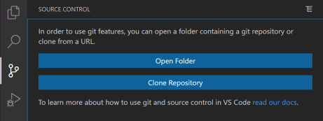

# Start 🚀

Die Angular Chuck Norris Challenge ist dein erster Einstieg in die Angular Webapp Entwicklung. Erledige alle Challenges damit Chuck Norris stolz auf dich ist! Im Rahmen des Projekts wirst du das Frontend einer 404-Fehlerseite gestalten, über das Global-State-Management in Angular erfahren, selbst eine Katzenbild-API anbinden und als Bonus Aufgabe deine Daten in einer externen Datenbank speichern.

# Ⅰ. Challenge 🎖️ - Start

### Ⅰ.Ⅰ. GitHub Account

Jeder geschriebene Programmcode muss auch gespeichert und weitergegeben werden können. GitHub ist eine übergreifende Entwicklerplattform die das ermöglicht und auch dieses Projekt speichert.

Erstelle dir, falls du noch keinen hast, zunächst einen eigenen GitHub Account auf [https://github.com/](https://github.com/). Dieser wird dich bei der innFacotory und in deinem späteren Entwickler-Leben noch lange begleiten.

Du wirst später nicht nur deinen Programmcode mit anderen in Projekten teilen (=Publishen), sondern in sogennanten Code-Reviews gegenseitig mit anderen Entwicklern den Code überprüfen und verbessern.

### Ⅰ.Ⅱ. Entwickeln aus der Entwicklungsumgebung

Softwareentwickler benötigen einen Ort an dem sie den Programmcode ansehen, schreiben und verändern können.

Dieser Ort ist die sogennante Entwicklungsumgebung, auf englisch Integrated Development Environment, abgekürzt IDE. Für die Angular Chuck Norris App benutzen du am Besten VS Code.

1. Installiere dir [Visual Studio Code](https://code.visualstudio.com/).
2. Öffne VS Code. Wenn du Lust hast, mache dich mit diesem [Tutorial](https://code.visualstudio.com/docs/getstarted/getting-started) in VS Code etwas vertraut.

### Ⅰ.Ⅲ. Webapp kopieren

In GitHub online gespeicherte Software muss zum Bearbeiten erst lokal auf deinem PC kopiert werden (=Geklont). Das geht ganz einfach mit VS Code.

VS Code kommt standardmäßig mit einer Anbidung für GitHub, dem Source Control Management. Öffne den Tab des Source Control und wähle "Clone Repository". Gebe nun die URL des Repositories `https://github.com/innFactory/angular-chuck-norris` ein und wähle einen beliebigen Speicherort auf deinem PC.



### Ⅰ.Ⅳ. Nodejs installieren

Die meisten Webapp Projekte haben Abhängigkeiten an andere Bibliotheken in Form von Paketen. Diese können mit dem Node Package Manager von Nodejs unkompliziert installiert werden. Installiere dir hierfür nun Nodejs und führe Node und NPM zum Test im Terminal in VS Code aus.

1. Installiere die Nodejs über den Installer [https://nodejs.org/en/download/](https://nodejs.org/en/download/).
2. Prüfe ob die Befehle `node`und `npm` in deinem System global funktionieren.

   - Öffne dazu in VS Code das Terminal über die obere Leiste `View -> Terminal`.
   - Gebe im Terminal die folgenden Befehle ein. Nacheinander solltest du die aktuell installierte Version sehen.

   ```bash
    node --version
    # Ausgabe z.B. "v22.18.0".

    npm --version
    # Ausgabe z.B. "10.9.3".

    npx --version
    # Ausgabe z.B. "10.9.3".
   ```

3. Mache dich über die weiteren Funktionen von NPM vertraut [https://docs.npmjs.com/about-npm](https://docs.npmjs.com/about-npm).

### Ⅰ.Ⅴ. Abhängigkeiten installieren

Nun installiere ganz einfach die Dependencies aus der Konsole mit dem Befehl `npm install` und warte bis sie heruntergeladen sind.

### Ⅰ.Ⅵ. WebApp starten

Nun kannst du das Webprojekt aus der Konsole starten mit `npm start`.

Öffne den Browser auf [http://localhost:4200](http://localhost:4200) und du solltest die Webapp sehen.


### Ⅰ.7. Einstieg in die App

Jede Angular Komponente in deiner WebApp besteht aus einem Logik-, einem Struktur- und einem Stylingteil. Sehe dir exemplarisch einmal die Home-Page Komponente genauer an. Navigiere in in den Pfad `src -> pages -> home` und sehe dir die Datein an.

| Datei     | Function                |
| --------- | ----------------------- |
| home.ts   | Logikteil in TypeScript |
| home.html | Strukturteil in HTML    |
| home.scss | Stylingteil in SCSS     |

Fühle dich nicht überfordert von all den verschiedenen Sprachen und Frameworks. Du bekommst eine Schritt für Schritt Einführung in die Angular Welt.

### Ⅰ.8. Kennenlernen mit Chuck Norris

Im Browser siehst du die Vorstellung von Chuck Norris. Die Struktur ist in der Markupsprache HTML verfasst.
Sieh dir die Struktur in der Homepage [home.html](./src/pages/home/home.html) einmal genauer an. Der Text `..Ich bin Chuck Norris, ein Kampfsportler und Schauspieler..` ist in einem HTML `<p>` Paragraph Element eingeschlossen bzw. gewrapped.

Recherchiere auf diesem Wikipedia Eintrag über [Chuck Norris selbst-erfundenen Kampfkünste](https://en.wikipedia.org/wiki/Chuck_Norris#Martial_arts_knowledge) und füge in der `home.html` Datei weitere Fakten über Chuck Norris hinzu. Die Änderungen erscheinen beim Speichern automatisch im Browser.

# Ⅱ. Challenge 🎖️ - Leseratte

### Ⅱ.Ⅰ. Offiziell ist am Besten - Angular Doku

Für jedes Framework und jede Sprache gibt es eine offiziele Dokumentation, so auch für Angular.

Bei Angular gibt es sogar ein interaktives Mini-Browser Tutorial. Schließe dieses [Tutorial](https://next.angular.dev/tutorials/learn-angular) ab.

Lese dir zum Einstieg außderdem folgende Angular-Artikel durch.

- Aufbau der Angular Komponenten: https://next.angular.dev/essentials/components
- Services
- Signals

### Ⅱ.Ⅱ. Schön muss es sein - Angular Material

Angular Material Guide

### Ⅱ.Ⅲ. TypeScript

TypeScript Guide

### Ⅱ.Ⅳ. HTML

HTML Guide

### Ⅱ.Ⅴ. CSS und SCSS

CSS und SCSS Guide

Geschafft! Das war aber eine Menge Input. Jetzt wird programmiert! Mache mit der [Ⅲ. Challenge](#ⅲ-challenge-️) weiter.

# Ⅲ. Challenge 🎖️ - Los geht's!

### Ⅲ.Ⅰ. Chuck Norris macht keine Fehler

Im Gegensatz zu Chuck Norris, dürfen wir Entwickler auch mal Fehler machen. Versuche im Browser eine Seite zu öffnen die es in unserer WebApp noch nicht gibt. Z.B. [[http://localhost:4200/diese-seite-gibts-ganz-bestimmt](http://localhost:4200/diese-seite-gibts-ganz-bestimmt)].

Was siehst du?

Eine leere seite mit Header und Footer? Wie langweilig! In unserem src/pages/ Ordner fehlt noch eine Not-Found Seite.

1. Sieh dir einmal bekannte Not-Found Seiten im Internet an:
2. In Angular kannst du ganz leicht aus der Kommandozeile neue Komponenten generieren. Öffne die Commandozeile im Projektordner angular-chuck-norris.
   Führe nun den Befehl `npx ng generate component ../pages/not-found` aus. Im src/pages Ordner sollte nun eine neue Angular Komponente im Unterordner not-found erscheinen.

Angular kommt standardmäßig mit einem WebApp Pfadaufbau. Dieser kann in der Datei [app.routes.ts](./src/app/app.routes.ts) angepasst werden.

Füge nun in in der Kommentierten Stelle die Not-Found Komponente hinzu. Vergesse nicht sie wie die anderen Seiten zu importieren.

```bash
  // {
  //   path: '**',
  //     component: ... , // Add error page
  // },
```

### Ⅲ.Ⅱ. Schönheit ist nicht alles - aber auch wichtig

"Es gibt keinen Schönheitswettbewerb mit Chuck Norris, denn alle wissen, dass er der einzige Gewinner wäre."

Passe nun die error.html Datei an und gestalte Sie ein bisschen. Besuche nochmal die nicht-existierende Seite. Füge auch etwas CSS hinzu. Du kannst es einfach in die SCSS Datei Schreiben. Jedes gültige CSS ist auch SCSS aber nicht andersherum.

# Ⅳ. Challenge 🎖️ - Lieblingswitz

# Ⅳ.Ⅰ. Ansehen

Sieh dir die Funktion Lieblingswitz einmal an. Gibst du einen Witz ein und klickst auf favorisieren, dann erscheint er in der Seite Favoriten. Das macht das Global State Management über Services in Angular möglich.

# Ⅳ.Ⅱ. Witze-Wettbewerb

Leider können die Witze von Chuck Norris bisher nicht gespeichert werden.

Button Favorisieren Funktion Chuck Norris.

Neuer Service Chucks Witze

In Seite Favoriten einbinden.

Tritt nun in einem Witze-Wettbewerb gegen Chuck Norris an.
Leider verschwinden Sie wieder und
Sieh dir einmal die Witze Seite an und generiere so viele Chuck Norris Witze wie du willst!

# Ⅴ. Challenge 🎖️ - Achtung Süße Katzenbilder!

### Ⅴ.Ⅰ.

Ansehen & Verstehen der Chuck Norris API

### Ⅴ.Ⅱ.

Anbinden der Katzen API

### Ⅴ.Ⅲ.

Favorisieren der Katzen in Tabelle

# Ⅵ. Challenge 🎖️ - Nur `Speicher`bares ist Wahres

### Ⅵ.Ⅰ.

Anbinden des Eigenen Firebase Projekts

### Ⅵ.Ⅱ.

Speicherung von Witzen zum Benutzer in der Firebase API.
